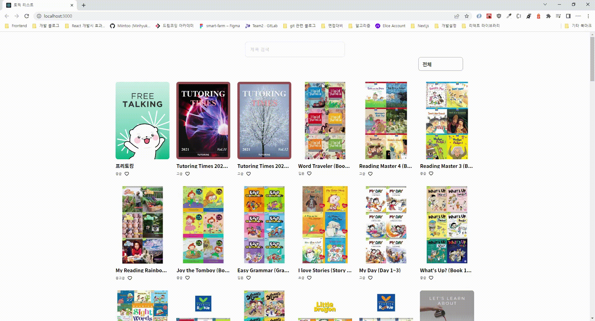
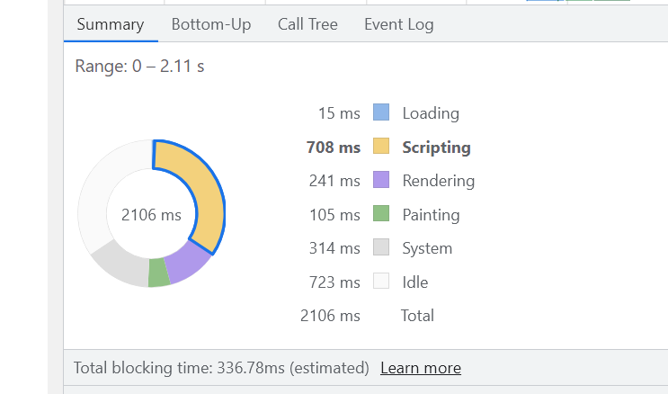
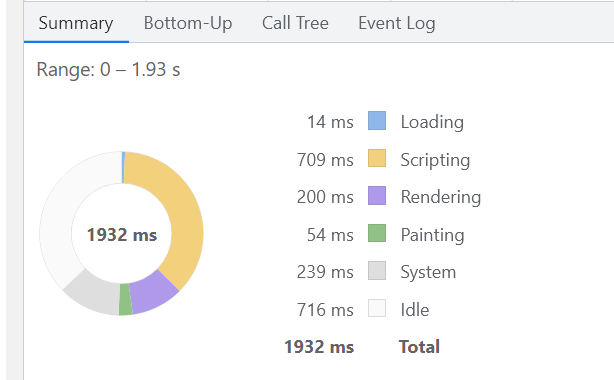

## 사용방법

1. npm install

- npm-lock.json 파일 활용을 위해 npm 명령어 사용해주세요.

2. npx json-server json-server/topic.json --port 3001로 json 서버 동작

- 클라이언트 API 요청이 PORT 3001으로 돼있으므로 3001로 서버 동작 시켜주세요.

3. npm run start

## 주요 기능

#### 1. 토픽 리스트

API 요청을 통해 비동기적으로 topic의 JSON 데이터를 받아와서 이미지, 제목, 등급을 활용해 전체 topic 데이터를 화면에 렌더링 했습니다.

#### 2. 토픽 카데고리

topic의 grade를 기준으로 입문, 초급, 중급, 중상급, 상급 마지막으로 전체를 보여줄 수 있는 카테고리를 만들고 카테고리를 기준으로 filtering 해서 topic을 보여주도록 했습니다.

하나의 상태값을 가지고 filter 함수를 이용해서 필더링을 해 업데이트를 할 경우 두 번째 카테고리를 클릭할 때는 원본 데이터가 이미 필더링이 된 상태에서 필터링 되기 때문에 아무 데이터도 나오지 않는 이슈가 있었습니다.

이를 해결하기 위해서 두가지 방법을 생각했습니다.

- 첫 번째는 카테고리 요청마다 다른 조건의 api를 요청해서 조건에 맞는 데이터만 다시 가져오는 방법이였습니다.

  하지만 이 방법은 현재 서버 api를 만들수는 없기 때문에 다른 방법을 생각해봤습니다.

- 두 번째 방법은 하나의 상태값을 별도로 만들어 전체 topic의 데이터를 저장하고 있는 방법입니다.

  이 방법을 통해서 filtering할 때 화면에 렌더링하기 위한 state와 처음에 받은 전체 topic의 전체를 저장하고 있는 state의 관리를 통해 이슈를 해결했습니다.

#### 3. 토픽 검색

topic의 타이틀을 기준으로 입력된 값이 포함이 되어있다면 실시간으로 조건에 맞는 topic이 나오도록 구현했습니다.

input의 상태값의 변경에 따라 지속적으로 조건을 판단하고 반복해서 화면이 렌더링이 되도록 구현해 입력만 해도 조건에 맞는 topic이 필터링이 되도록 했습니다.

이런 방법은 반복적인 렌더링이 발생해 성능에 좋지 않기 때문에 디바운싱과 쓰로틀링을 고민해봤지만 이 서비스의 경우 한 글자 입력될때마다 조건을 판단해 결과를 보여줘야 하고 하나의 입력마다 네트워크 요청을 보내는게 아니기 때문에 두 기법에 대해서는 배제했습니다.

#### 4. 좋아요 버튼

좋아요 버튼이 있고 이에 대한 상호작용과 새로고침을 해도 좋아요는 계속 유지 되도록 구현했습니다.

좋아요 상태의 유지를 위해 localstorage를 활용했습니다.
각 topic의 idx 값을 이용해 좋아요가 클릭된 topic들은 모두 저장하고 좋아요를 한 번더 클릭해 좋아요 버튼을 비활성화 시켰을 경우에는 해당 배열에서 idx를 제거하는 방식으로 구현했습니다.

그리고 화면이 렌더링 될때 각 topic 별로 localstorage에 해당 topic의 idx가 저장됐는지 판단해 true라면 빨간 하트를 보여주고 false라면 비어있는 하트를 보여주도록 로직을 작성했습니다.

## 추가 사항

#### 1. 이미지 최적화

- 이미지에 lazy loading 적용했습니다.

위에 사진은 before이고 아래는 image lazing을 적용한 후의 성능 측정 결과입니다.

받아와야 하는 이미지가 많기 때문에 이를 한 번에 받아올 경우 네트워크 리소스도 많이들고 받아온 이미지를 렌더링하는데도 시간이 많이 소요가 되어 사용자 경험 측면에도 안 좋다고 생각했습니다.

image lazing을 통해 사용자가 스크롤을 내렸을때 이미지를 받아오도록 해 초기에 사용자 경험을 개선했습니다.
